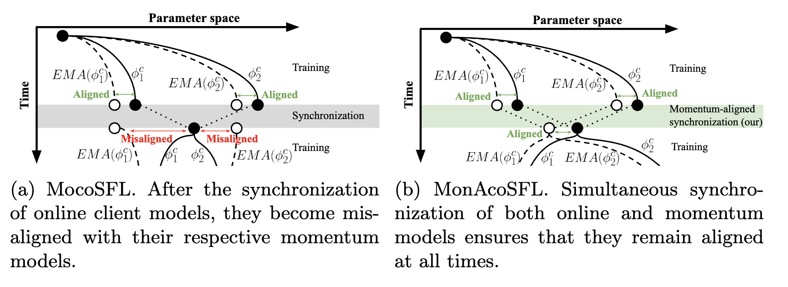

# MonAcoSFL

Codebase for "A deep cut into Split Federated Self-supervised Learning"
This repository implements Momentum-Aligned contrastive Split Federated Learning (MonAcoSFL). 

It is an extension of MocoSFL, which keeps the online/momentum client models aligned during parameter synchronizations. 
This stabilizes the training and yields vastly improved results in deeper cut-layers that are more communication-efficient.

## Comparison of MocoSFL and MonAcoSFL

## Getting Started

### Prerequisite:

Python > 3.7 with Pytorch, Torchvision

### Project Structure

`/run_monacosfl.py` -- Source files for MonAcoSFL

`/scripts` -- Evaluation scripts used on a single-GPU machine

## Acknowledgments

This repository is based on the [original MocoSFL codebase](https://github.com/SonyResearch/MocoSFL). 
We would like to thank the authors for open-sourcing it.